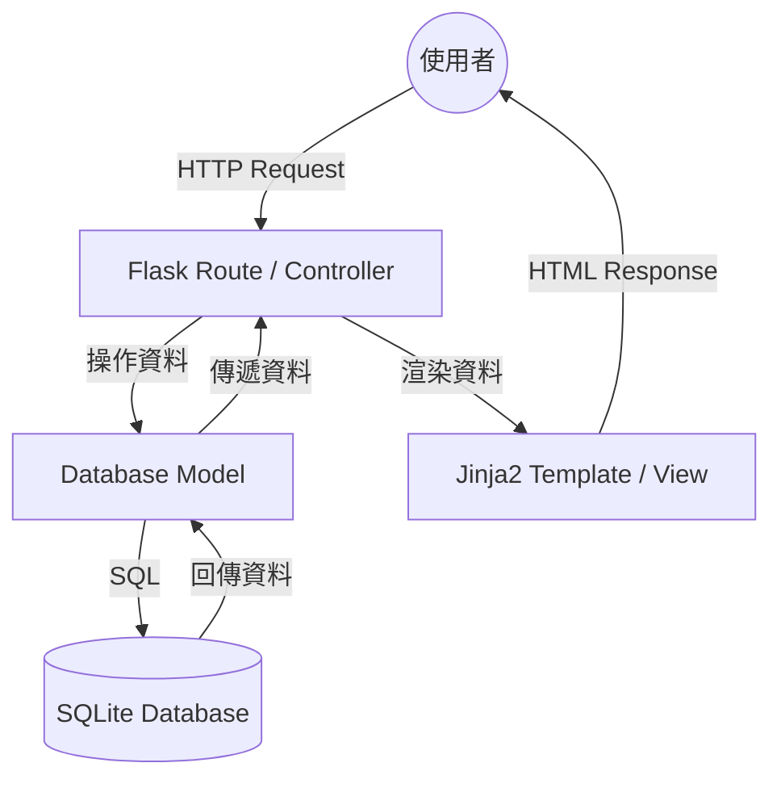

# 系統架構設計文件 (ARCHITECTURE)

## 1. 技術架構說明

本專案採用 **Flask** 作為核心開發框架，並遵循類 **MVC (Model-View-Controller)** 的架構模式，確保程式碼結構清晰且易於維護。

### 選用技術
- **後端 (Controller)**: **Python + Flask**
  - 原因：輕量級、彈性大，適合快速原型開發。
- **模板引擎 (View)**: **Jinja2**
  - 原因：Flask 內建，支援強大的模板繼承與動態 HTML 渲染。
- **資料庫 (Model)**: **SQLite**
  - 原因：零設定、檔案式資料庫，適合中小型專案或教學練習。
- **資料庫存取**: **SQLAlchemy** (建議) 或 **sqlite3**
  - 原因：提供物件關聯映射 (ORM)，讓資料庫操作更直觀。

### MVC 職責分配
- **Model (模型)**：負責定義資料結構（Schema）以及與資料庫的互動邏輯。
- **View (視圖)**：由 Jinja2 模板組成，負責呈現使用者看到的 HTML 頁面。
- **Controller (控制器)**：由 Flask Routes 負責，處理使用者請求、呼叫 Model 取得資料，並決定渲染哪個 View。

---

## 2. 專案資料夾結構

```text
/
├── app/                    # 應用程式核心目錄
│   ├── __init__.py         # 初始化 Flask App
│   ├── models/             # 資料庫模型 (Models)
│   │   └── task.py         # 任務相關資料結構
│   ├── routes/             # 路由處理 (Controllers)
│   │   ├── main.py         # 主頁面路由
│   │   └── task.py         # 任務操作路由
│   ├── templates/          # HTML 模板 (Views)
│   │   ├── base.html       # 基礎版面 (Navbar, Header)
│   │   ├── index.html      # 首頁
│   │   └── tasks/          # 任務相關頁面
│   └── static/             # 靜態資源
│       ├── css/            # 樣式表
│       └── js/             # JavaScript
├── docs/                   # 專案文件 (PRD, ARCHITECTURE 等)
├── instance/               # 實例資料夾 (不進 Git 版本控制)
│   └── database.db         # SQLite 資料庫檔案
├── app.py                  # 專案啟動入口 (Entry Point)
├── requirements.txt        # Python 依賴套件清單
└── config.py               # 系統配置設定
```

---

## 3. 元件關係圖

以下展示了資料流向與元件間的互動：



---

## 4. 關鍵設計決策

1. **單體架構 (Monolithic)**：
   - **原因**：為了簡化開發與部署流程，不採用前後端分離，直接由 Flask 渲染頁面。這在初期開發與練習中能更快速看到成果。
2. **藍圖模式 (Blueprints)**：
   - **原因**：使用 Flask Blueprints 來組織路由（例如 `app/routes/`），當專案功能增加時，可以輕鬆擴展而不顯得混亂。
3. **模板繼承 (Template Inheritance)**：
   - **原因**：利用 Jinja2 的 `` 功能，統一導覽列、頁尾與 CSS 引入，避免重複程式碼。
4. **SQLite 檔案儲存**：
   - **原因**：將資料庫放在 `instance/` 資料夾內，確保資料庫與程式碼邏輯分離，且方便在不同環境間移動。
