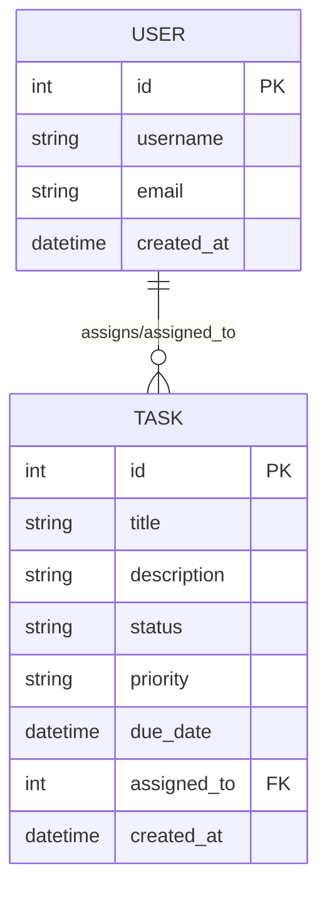

# 資料庫設計文件 (DB_DESIGN)

## 1. ER 圖 (Entity-Relationship Diagram)



---

## 2. 資料表詳細說明

### 2.1 USER (使用者表)
儲存系統使用者資訊，用於分配任務。

| 欄位名 | 型別 | 說明 | 必填 | 備註 |
| :--- | :--- | :--- | :--- | :--- |
| id | INTEGER | 流水號 | 是 | PRIMARY KEY |
| username | TEXT | 使用者名稱 | 是 | UNIQUE |
| email | TEXT | 電子郵件 | 是 | |
| created_at | DATETIME | 帳號建立時間 | 是 | 預設為目前時間 |

### 2.2 TASK (任務表)
儲存所有任務的詳細資訊。

| 欄位名 | 型別 | 說明 | 必填 | 備註 |
| :--- | :--- | :--- | :--- | :--- |
| id | INTEGER | 流水號 | 是 | PRIMARY KEY |
| title | TEXT | 任務標題 | 是 | |
| description | TEXT | 任務內容描述 | 否 | |
| status | TEXT | 狀態 (待處理/進行中/已完成) | 是 | 預設：待處理 |
| priority | TEXT | 優先級 (低/中/高) | 是 | 預設：中 |
| due_date | DATETIME | 截止日期 | 否 | |
| assigned_to | INTEGER | 負責人 ID | 否 | FOREIGN KEY (USER.id) |
| created_at | DATETIME | 建立時間 | 是 | 預設為目前時間 |

---

## 3. SQL 建表語法 (database/schema.sql)

```sql
-- 建立使用者表
CREATE TABLE IF NOT EXISTS users (
    id INTEGER PRIMARY KEY AUTOINCREMENT,
    username TEXT NOT NULL UNIQUE,
    email TEXT NOT NULL,
    created_at DATETIME DEFAULT CURRENT_TIMESTAMP
);

-- 建立任務表
CREATE TABLE IF NOT EXISTS tasks (
    id INTEGER PRIMARY KEY AUTOINCREMENT,
    title TEXT NOT NULL,
    description TEXT,
    status TEXT NOT NULL DEFAULT '待處理',
    priority TEXT NOT NULL DEFAULT '中',
    due_date DATETIME,
    assigned_to INTEGER,
    created_at DATETIME DEFAULT CURRENT_TIMESTAMP,
    FOREIGN KEY (assigned_to) REFERENCES users(id)
);
```
