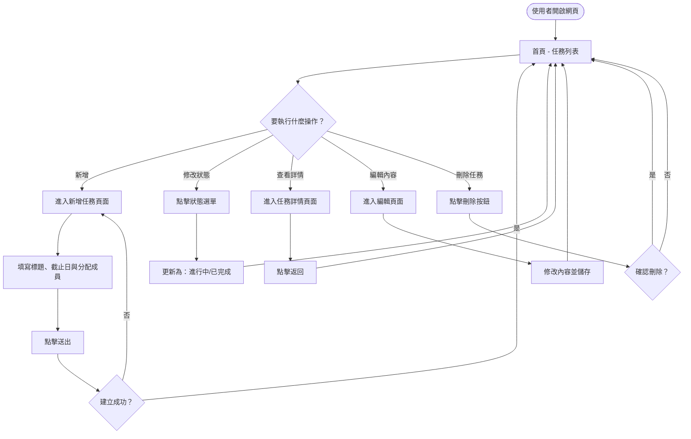
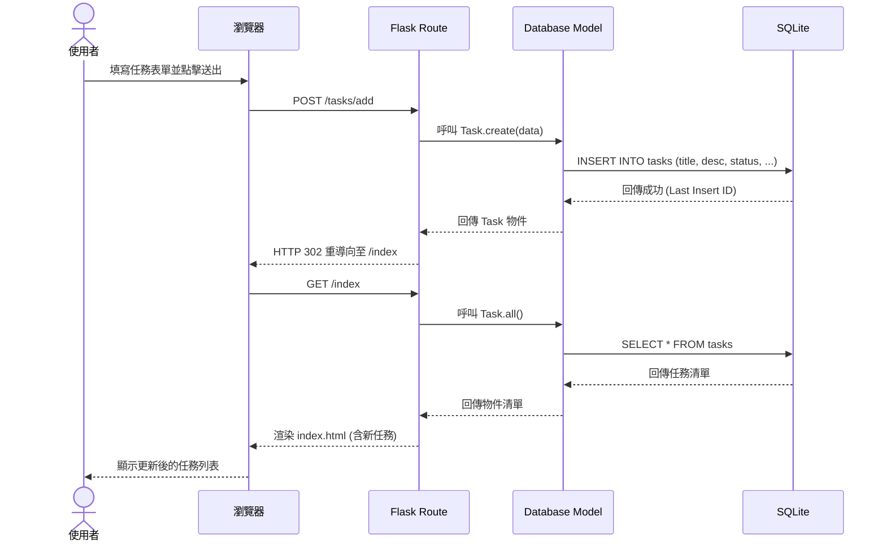

# 流程圖設計文件 (FLOWCHART)

## 1. 使用者流程圖 (User Flow)

此流程圖展示了使用者在「任務管理系統」中的主要操作路徑。

---

## 2. 系統序列圖 (Sequence Diagram)

此圖以「新增任務」為例，展示資料如何在各元件間傳遞。

---

## 3. 功能清單與路由對照表

根據流程圖規劃的初步路由規劃：

| 功能 | HTTP 方法 | URL 路徑 | 說明 |
| :--- | :--- | :--- | :--- |
| 任務列表 (首頁) | GET | `/` | 顯示所有任務 |
| 新增任務頁面 | GET | `/tasks/new` | 顯示新增表單 |
| 執行新增任務 | POST | `/tasks/add` | 接收表單並存入資料庫 |
| 任務詳情 | GET | `/tasks/<id>` | 顯示單筆任務內容 |
| 編輯任務頁面 | GET | `/tasks/<id>/edit` | 顯示編輯表單 |
| 執行更新任務 | POST | `/tasks/<id>/update` | 更新任務資料 |
| 刪除任務 | POST | `/tasks/<id>/delete` | 刪除單筆任務 |
| 更新任務狀態 | POST | `/tasks/<id>/status` | 快速切換狀態 (進行中/已完成) |
